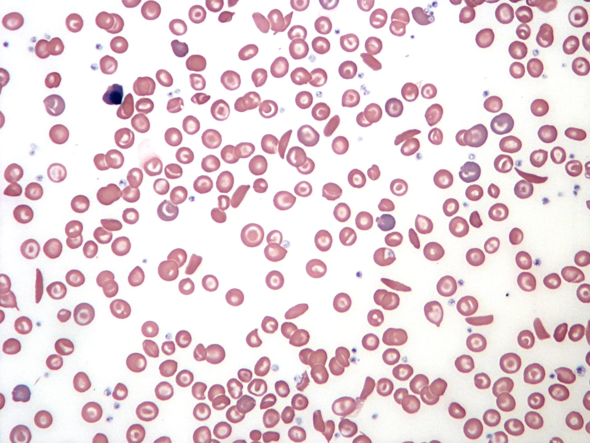
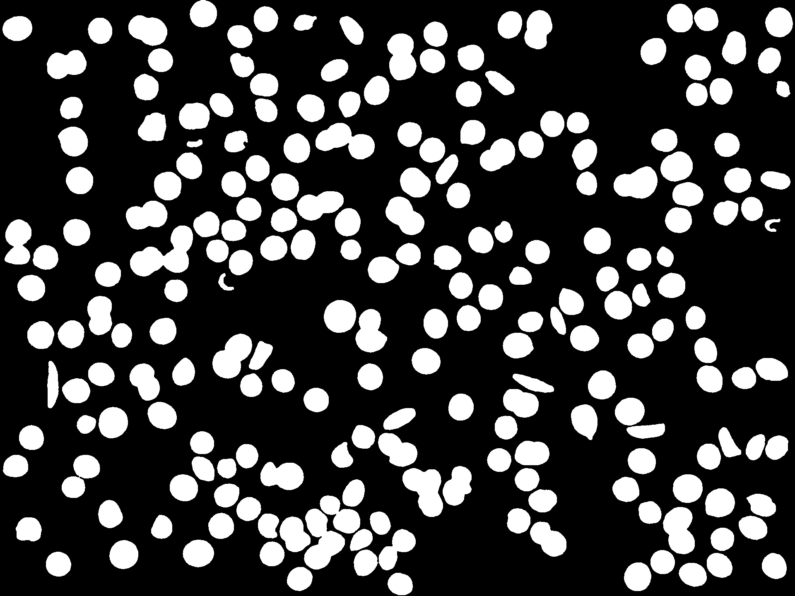
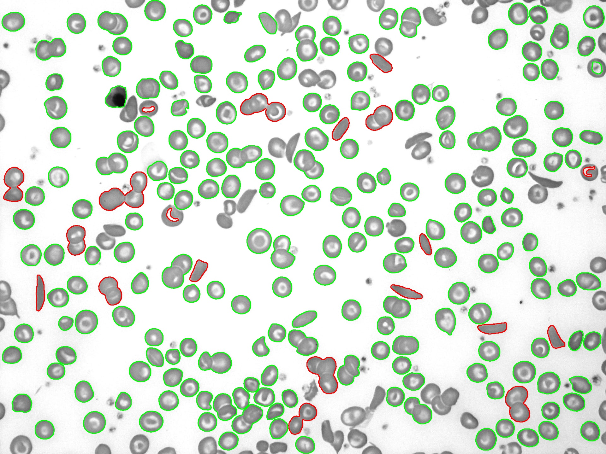
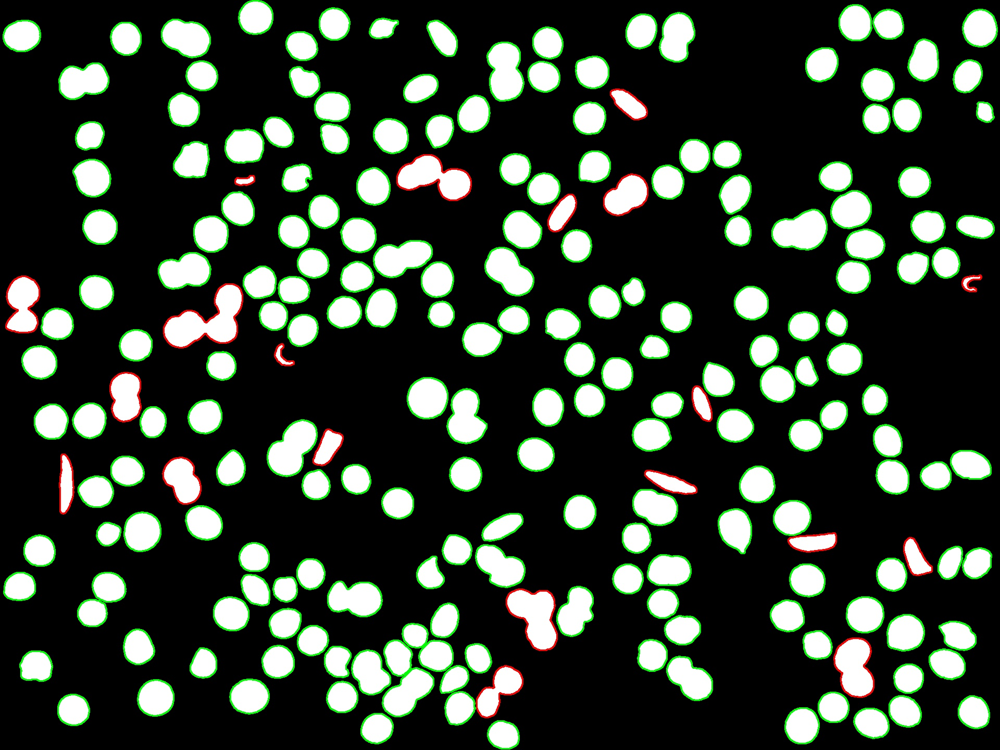

# SCD Classifier: Sickle Cell Disease Detection from Red Blood Cell Images

A machine learning model for detecting Sickle Cell Disease (SCD) from images of red blood cell (RBC) samples. This project utilizes a combination of image processing techniques, feature extraction, and neural network classification to identify sickle cells.  An ensemble method combining the neural network with a KNN classifier is also implemented.

## Overview

This project presents a machine learning approach to identify SCD by analyzing RBC images.  We process microscopic images to extract key features, train a neural network (along with a KNN model), and combine their predictions for a more accurate classification of cells as either healthy or sickle-shaped.  This could be useful in preliminary screening or in resource-limited settings.

## Table of Contents

- [Dataset](#dataset)
- [Image Preprocessing](#image-preprocessing)
- [Feature Extraction](#feature-extraction)
- [Data Splitting](#data-splitting)
- [Neural Network Model](#neural-network-model)
- [KNN Classifier](#knn-classifier)
- [Ensemble Method](#ensemble-method)
- [Performance](#performance)
- [Usage](#usage)
- [Example Results](#example-results)
- [Future Improvements](#future-improvements)
- [Acknowledgements](#acknowledgements)

## Dataset

The **erythrocytesIDB** dataset, developed by the University of the Balearic Islands, is used in this project. It comprises 626 images of individual RBCs categorized into:

-   **Normal Erythrocytes:** 202 images
-   **Sickle Cells:** 211 images
-   **Other Deformations:** 213 images

Each image is in JPG format with a resolution of 80x80 pixels.

More Info: [http://erythrocytesidb.uib.es/](http://erythrocytesidb.uib.es/)

## Image Preprocessing

Before feature extraction, images undergo several preprocessing steps to enhance segmentation and analysis:

1.  **Grayscale Conversion:** The input image is converted to grayscale for simplified processing.  Here's an example input image:

    

2.  **Edge Detection (Canny):**  The Canny edge detection algorithm identifies cell boundaries within the grayscale image.

3.  **Binary Fill Operations:** Fills holes and imperfections within the detected cell regions, creating solid objects.

4.  **Object Segmentation:** Isolates individual RBCs from the background.

5.  **Size Filtering:** Retains structures exceeding a predefined size threshold to remove noise and small artifacts. This step results in a binary mask.

    

## Feature Extraction

After preprocessing, key features are extracted from each segmented cell:

*   **Area:** The number of pixels within the cell boundary.
*   **Perimeter:** The length of the cell boundary.
*   **Circularity:** Indicates how close the shape is to a perfect circle. This is calculated as  (4 * pi * Area) / (Perimeter^2).

These features are stored in a CSV file (cell_features.csv), which is then used for training the machine learning models.

## Data Splitting

The dataset is divided into three subsets:

*   **Training Set (60%):** Used for training the neural network and KNN models.
*   **Validation Set (20%):** Used for tuning hyperparameters and monitoring the model's performance during training.
*   **Testing Set (20%):** Used for evaluating the final model's performance on unseen data.

Data augmentation using RandomOverSampler is performed on the training data to address class imbalance, ensuring the model is robust and doesn't overfit to the majority class.  A StandardScaler is fit on the training data and used to scale all the data.  The scaler is saved and reloaded for use in prediction on new images.

## Neural Network Model

The neural network model is implemented using TensorFlow/Keras and consists of the following layers:

*   **Input Layer:** 3 neurons corresponding to the extracted features (area, perimeter, circularity).
*   **Hidden Layers:** Multiple dense layers with ReLU activation, batch normalization, and dropout for regularization.
*   **Output Layer:** Single neuron with sigmoid activation for binary classification (0 for healthy, 1 for sickle cell).

The model is compiled with:

*   **Loss Function:** Binary cross-entropy.
*   **Optimizer:** Adam.
*   **Metrics:** Accuracy, Precision, Recall, and AUC.

## KNN Classifier

A K-Nearest Neighbors (KNN) classifier is also trained using the extracted features. This provides a complementary approach to classification.  The optimal number of neighbors (k) is determined through experimentation, and the trained KNN model is saved for later use.

## Ensemble Method

To improve prediction accuracy, we use an ensemble method that combines the predictions of the neural network and the KNN classifier. The final prediction is made based on a majority voting scheme: if at least one of the models predicts a sickle cell, the cell is classified as sickle.

## Performance

**Ensemble Model Performance:**

The ensemble model achieved the following performance metrics on the test dataset:

*   **Accuracy:** 86.83%
*   **Precision (Sickle Cell - class 1):** 63%
*   **Recall (Sickle Cell - class 1):** 96%
*   **F1-Score (Sickle Cell - class 1):** 76%

For a broader evaluation of the ensemble model:

*   **Macro Average Precision:** 81%
*   **Macro Average Recall:** 90%
*   **Macro Average F1-Score:** 84%
*   **Weighted Average Accuracy:** 87%

**Neural Network Model Performance:**

The neural network model alone achieved the following performance metrics on the test dataset:

*   **Accuracy:** 91.54% (reported as 0.9154471755027771) and 92% in the classification report.
*   **Precision (Sickle Cell - class 1):** 77% (reported as 0.7692307829856873) and 77% in the classification report.
*   **Recall (Sickle Cell - class 1):** 91% (reported as 0.9090909361839294) and 91% in the classification report.
*   **F1-Score (Sickle Cell - class 1):** 83% in the classification report.

The neural network also reported an AUC (Area Under the ROC Curve) of 0.9719 (or 0.9755).

For a broader evaluation of the neural network model:

*   **Macro Average Precision:** 87%
*   **Macro Average Recall:** 91%
*   **Macro Average F1-Score:** 89%
*   **Weighted Average Accuracy:** 92%

**KNN Model Performance:**

The KNN model achieved the following performance metrics on the test dataset:

*   **Accuracy:** 86.50%
*   **Precision (Sickle Cell - class 1):** 63%
*   **Recall (Sickle Cell - class 1):** 91%
*   **F1-Score (Sickle Cell - class 1):** 75%

For a broader evaluation of the KNN model:

*   **Macro Average Precision:** 80%
*   **Macro Average Recall:** 88%
*   **Macro Average F1-Score:** 83%
*   **Weighted Average Accuracy:** 90%

## Example Results

The prediction script marks the original image and the binary mask to highlight detected sickle cells:

*   **Marked Image:**  Sickle cells are outlined in red, and healthy cells are outlined in green.

    

*   **Marked Mask:** The binary mask with sickle cells outlined in red and healthy cells in green.

    

## Future Improvements

*   **Dataset Expansion:** Incorporate additional data to enhance model generalization. A larger and more diverse dataset could significantly improve the model's robustness.
*   **Exploration of CNN Architectures:** Investigate Convolutional Neural Network (CNN) models like ResNet-50 and MobileNet for direct image classification. These architectures are designed to automatically learn relevant features from images, potentially eliminating the need for manual feature extraction.
*   **Hyperparameter Optimization:** Fine-tune the hyperparameters of both the neural network and KNN models to further boost accuracy and performance.  Techniques like grid search or Bayesian optimization could be used.
*   **Advanced Image Preprocessing:** Experiment with more sophisticated image preprocessing techniques, such as adaptive thresholding, morphological operations, and noise reduction filters, to improve the quality of cell segmentation.
*   **Incorporate Cell Shape Analysis:** Explore more advanced shape features beyond circularity, such as elongation, convexity, and solidity, to better differentiate between healthy and sickle cells.
